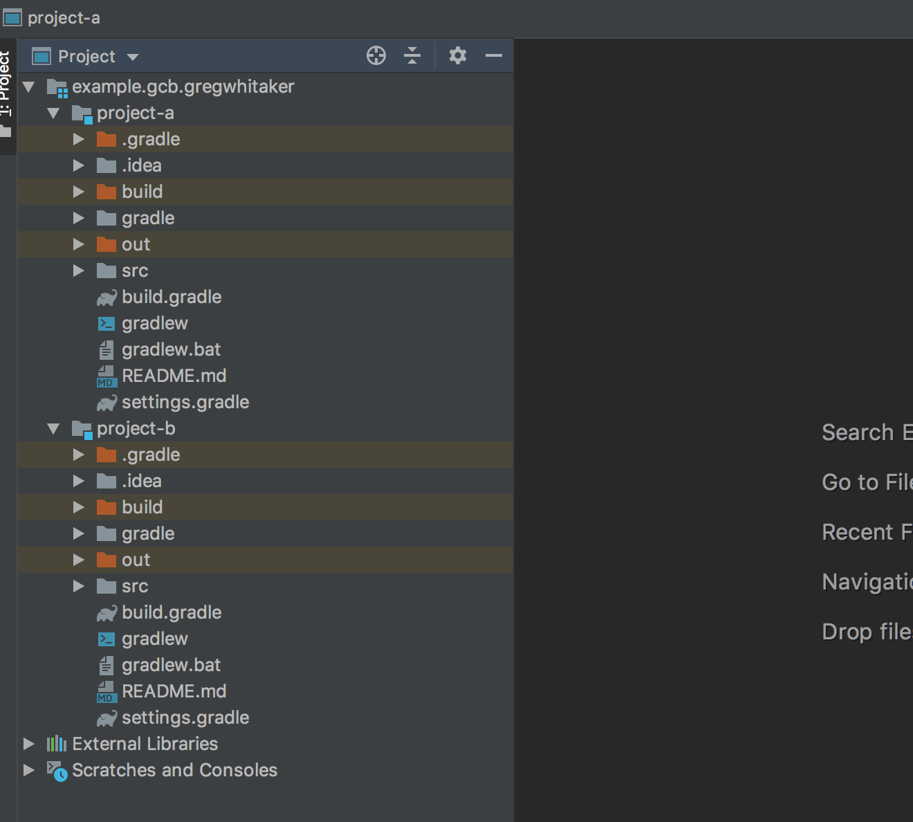

# gradle-monorepo-example

An example of building projects in a monorepo using [Gradle Composite Builds](https://docs.gradle.org/current/userguide/composite_builds.html).

## Repository Structure
The repository contains four projects each with their own Gradle configurations.

Projects A, B, and C have dependencies on one another:

    [project-a] -- DEPENDS --> [project-b] -- DEPENDS --> [project-c]
    
Project D has no dependencies on the other projects:
    
    [project-d]

## Running the Example
Follow the steps below to run the example:

### Build Project A
Run the following commands to build [project-a](project-a):

1. Change the working directory to [project-a](project-a):

        cd project-a
        
2. Run the following command to generate classes for the project:

        ./gradlew classes --info
        
    Notice in the command output that [project-b](project-b) and [project-c](project-c) was also configured and built, 
    but [project-d](project-d) was neither configured or built:

        > Configure project :project-b
        Evaluating project ':project-b' using build file '/Users/greg/workspace/gradle-compositebuild-example/project-b/build.gradle'.
        Registering project ':project-b' in composite build. Will substitute for module 'example.gcb.gregwhitaker:project-b'.
        [composite-build] Configuring build: /Users/greg/workspace/gradle-compositebuild-example/project-c
        
        > Configure project :project-c
        Evaluating project ':project-c' using build file '/Users/greg/workspace/gradle-compositebuild-example/project-c/build.gradle'.
        Registering project ':project-c' in composite build. Will substitute for module 'example.gcb.gregwhitaker:project-c'.
        
        > Configure project :
        Evaluating root project 'project-a' using build file '/Users/greg/workspace/gradle-compositebuild-example/project-a/build.gradle'.
        All projects evaluated.
        Selected primary task 'classes' from project :
        Found project 'project :project-b' as substitute for module 'example.gcb.gregwhitaker:project-b'.
        Selected primary task ':jar' from project :
        Found project 'project :project-c' as substitute for module 'example.gcb.gregwhitaker:project-c'.
        Selected primary task ':jar' from project :
        Executing project-b tasks [:jar]
        Executing project-c tasks [:jar]
        Tasks to be executed: [task ':compileJava', task ':processResources', task ':classes']
        :project-b:processResources (Thread[Task worker for ':project-b',5,main]) started.
        :project-c:compileJava (Thread[Task worker for ':project-c' Thread 3,5,main]) started.
        :processResources (Thread[Task worker for ':' Thread 4,5,main]) started.
        
        > Task :project-b:processResources NO-SOURCE
        Skipping task ':project-b:processResources' as it has no source files and no previous output files.
        :project-b:processResources (Thread[Task worker for ':project-b',5,main]) completed. Took 0.005 secs.
        
        > Task :processResources NO-SOURCE
        Skipping task ':processResources' as it has no source files and no previous output files.
        :processResources (Thread[Task worker for ':' Thread 4,5,main]) completed. Took 0.004 secs.
        
        > Task :project-c:compileJava UP-TO-DATE
        Skipping task ':project-c:compileJava' as it is up-to-date.
        :project-c:compileJava (Thread[Task worker for ':project-c' Thread 3,5,main]) completed. Took 0.007 secs.
        :project-c:processResources (Thread[Task worker for ':project-c' Thread 3,5,main]) started.
        
        > Task :project-c:processResources NO-SOURCE
        Skipping task ':project-c:processResources' as it has no source files and no previous output files.
        :project-c:processResources (Thread[Task worker for ':project-c' Thread 3,5,main]) completed. Took 0.0 secs.
        :project-c:classes (Thread[Task worker for ':project-c' Thread 3,5,main]) started.
        
        > Task :project-c:classes UP-TO-DATE
        Skipping task ':project-c:classes' as it has no actions.
        :project-c:classes (Thread[Task worker for ':project-c' Thread 3,5,main]) completed. Took 0.0 secs.
        :project-c:jar (Thread[Task worker for ':project-c' Thread 3,5,main]) started.
        
        > Task :project-c:jar UP-TO-DATE
        Skipping task ':project-c:jar' as it is up-to-date.
        :project-c:jar (Thread[Task worker for ':project-c' Thread 3,5,main]) completed. Took 0.002 secs.
        :project-b:compileJava (Thread[Task worker for ':project-b' Thread 2,5,main]) started.
        
        > Task :project-b:compileJava UP-TO-DATE
        Skipping task ':project-b:compileJava' as it is up-to-date.
        :project-b:compileJava (Thread[Task worker for ':project-b' Thread 2,5,main]) completed. Took 0.005 secs.
        :project-b:classes (Thread[Task worker for ':project-b' Thread 2,5,main]) started.
        
        > Task :project-b:classes UP-TO-DATE
        Skipping task ':project-b:classes' as it has no actions.
        :project-b:classes (Thread[Task worker for ':project-b' Thread 2,5,main]) completed. Took 0.0 secs.
        :project-b:jar (Thread[Task worker for ':project-b' Thread 2,5,main]) started.
        
        > Task :project-b:jar UP-TO-DATE
        Skipping task ':project-b:jar' as it is up-to-date.
        :project-b:jar (Thread[Task worker for ':project-b' Thread 2,5,main]) completed. Took 0.002 secs.
        :compileJava (Thread[Task worker for ':' Thread 4,5,main]) started.
        
        > Task :compileJava UP-TO-DATE
        Skipping task ':compileJava' as it is up-to-date.
        :compileJava (Thread[Task worker for ':' Thread 4,5,main]) completed. Took 0.004 secs.
        :classes (Thread[Task worker for ':' Thread 4,5,main]) started.
        
        > Task :classes UP-TO-DATE
        Skipping task ':classes' as it has no actions.
        :classes (Thread[Task worker for ':' Thread 4,5,main]) completed. Took 0.0 secs.

        BUILD SUCCESSFUL in 0s

### Build Project D
Run the following commands to build [project-d](project-d):

1. Change the working directory to [project-d](project-d):

        cd project-d
        
2. Run the following command to generate classes for the project:

        ./gradlew classes --info
        
    Notice that only [project-d](project-d) was configured and built:
        
        > Configure project :
        Evaluating root project 'project-d' using build file '/Users/greg/workspace/gradle-compositebuild-example/project-d/build.gradle'.
        All projects evaluated.
        Selected primary task 'classes' from project :
        Tasks to be executed: [task ':compileJava', task ':processResources', task ':classes']
        :compileJava (Thread[Task worker for ':',5,main]) started.
        
        > Task :compileJava UP-TO-DATE
        Skipping task ':compileJava' as it is up-to-date.
        :compileJava (Thread[Task worker for ':',5,main]) completed. Took 0.006 secs.
        :processResources (Thread[Task worker for ':',5,main]) started.
        
        > Task :processResources NO-SOURCE
        Skipping task ':processResources' as it has no source files and no previous output files.
        :processResources (Thread[Task worker for ':',5,main]) completed. Took 0.0 secs.
        :classes (Thread[Task worker for ':',5,main]) started.
        
        > Task :classes UP-TO-DATE
        Skipping task ':classes' as it has no actions.
        :classes (Thread[Task worker for ':',5,main]) completed. Took 0.0 secs.
        
        BUILD SUCCESSFUL in 0s
        
## Working in IntelliJ
IntelliJ supports Gradle Composite Builds and will automatically open any included builds for a project.

To see this in action, open [project-a](project-a) in your IntelliJ IDE. You will notice that IntelliJ automatically
opens [project-b](project-d) because it is a dependency of the current project.

        
## License
MIT License

Copyright (c) 2019 Greg Whitaker

Permission is hereby granted, free of charge, to any person obtaining a copy
of this software and associated documentation files (the "Software"), to deal
in the Software without restriction, including without limitation the rights
to use, copy, modify, merge, publish, distribute, sublicense, and/or sell
copies of the Software, and to permit persons to whom the Software is
furnished to do so, subject to the following conditions:

The above copyright notice and this permission notice shall be included in all
copies or substantial portions of the Software.

THE SOFTWARE IS PROVIDED "AS IS", WITHOUT WARRANTY OF ANY KIND, EXPRESS OR
IMPLIED, INCLUDING BUT NOT LIMITED TO THE WARRANTIES OF MERCHANTABILITY,
FITNESS FOR A PARTICULAR PURPOSE AND NONINFRINGEMENT. IN NO EVENT SHALL THE
AUTHORS OR COPYRIGHT HOLDERS BE LIABLE FOR ANY CLAIM, DAMAGES OR OTHER
LIABILITY, WHETHER IN AN ACTION OF CONTRACT, TORT OR OTHERWISE, ARISING FROM,
OUT OF OR IN CONNECTION WITH THE SOFTWARE OR THE USE OR OTHER DEALINGS IN THE
SOFTWARE.
